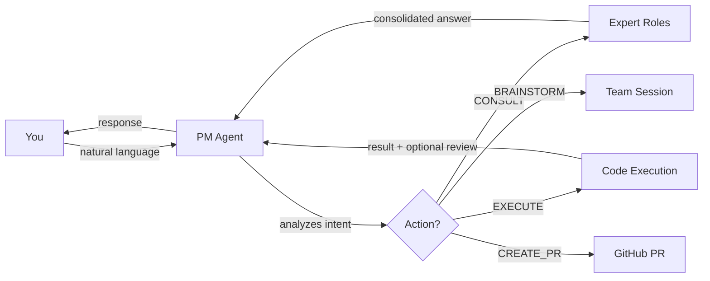
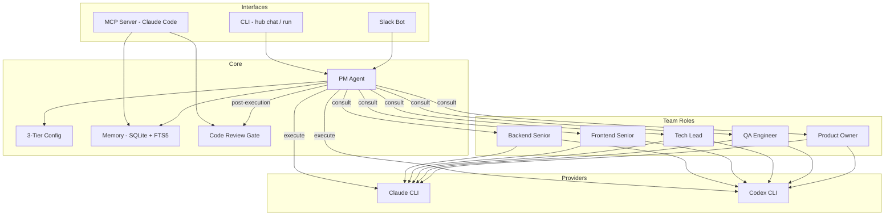
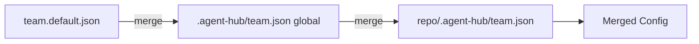
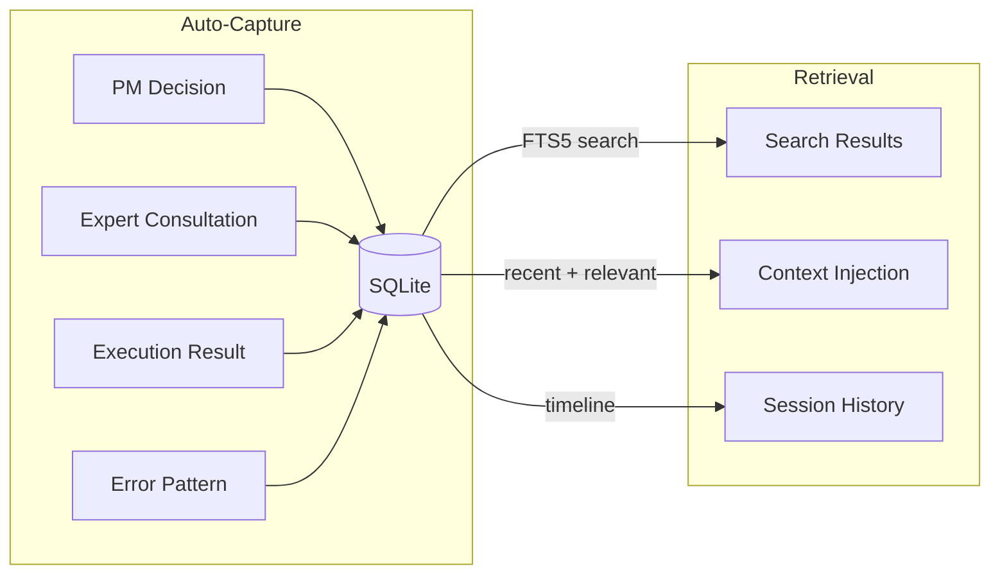
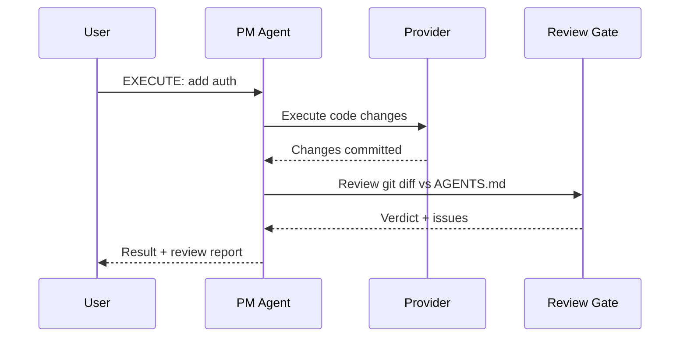

# Agent Hub

Multi-agent development orchestrator powered by AI. Talk to a PM in natural language, delegate to expert roles, execute code changes, and review — all from CLI, Slack, or Claude Code.

## How it works



The PM agent interprets your request, classifies intent, and orchestrates the right action — consulting experts, executing code, or brainstorming with the team.

## Architecture



## Features

| Feature | Description |
|---------|-------------|
| **Conversational PM** | Natural language interface that classifies intent and orchestrates actions |
| **Expert Roles** | Configurable team roles (backend, frontend, tech-lead, QA, PO) with provider fallback chains |
| **Code Execution** | AI-powered code changes in isolated worktrees with commit/push/PR |
| **Memory System** | SQLite + FTS5 persistent memory across sessions with auto-capture |
| **Code Review Gate** | Optional post-execution review against AGENTS.md/CLAUDE.md rules |
| **MCP Server** | 13 native tools for Claude Code integration |
| **3-Tier Config** | Defaults → global → per-repo configuration merge |
| **Standardized Envelope** | Structured JSON responses from all providers |
| **Multi-repo Projects** | Manage multiple repositories per project with Slack channel routing |

## Quick Start

```bash
cd hub
npm install
node bin/hub.mjs init       # Interactive setup wizard
```

The wizard detects installed tools (Claude CLI, Codex, gh), asks for your GitHub account, and generates all config files.

```bash
node bin/hub.mjs profile select work
node bin/hub.mjs chat --repo /path/to/repo
```

## Usage Modes

### CLI

```bash
hub run --repo ./my-app "Add pagination to the users API"
hub chat --repo ./my-app
hub review --repo ./my-app --goal "Refactored auth module"
```

### Slack Bot

```bash
hub slack socket
```

Talk to the PM in Slack threads. The bot handles consultations, executions, brainstorms, and PR creation.

### MCP Server (Claude Code)

```bash
claude mcp add agent-hub node /path/to/hub/bin/mcp.mjs
```

After restarting Claude Code, 13 tools are available natively:

```
memory_search, memory_save, memory_get, memory_context,
memory_delete, memory_stats, code_review, team_roles,
team_config, project_list, project_show, session_start, session_end
```

## Configuration



Config is merged in 3 tiers: defaults, global overrides, and per-repo overrides. Sensitive files are gitignored with `.example` templates provided.

### Manual Setup

If you prefer manual configuration over the wizard:

```bash
cp hub/.agent-hub/team.example.json hub/.agent-hub/team.json
cp hub/config/profiles.example.json hub/config/profiles.json
cp hub/config/projects.example.json hub/config/projects.json
cp hub/config/slack/.env.example hub/config/slack/.env
cp hub/config/slack/repo-map.example.json hub/config/slack/repo-map.json
```

## Memory System

Persistent memory powered by SQLite with FTS5 full-text search. Observations are auto-captured from PM flows (decisions, consultations, executions, errors) and injected as context into future prompts.



Features:
- **Dedup**: SHA-256 hash prevents duplicates within 15-minute windows
- **Topic key upsert**: Same topic updates instead of creating new entries
- **3-layer retrieval**: compact search, timeline, full content

## Code Review Gate

Optional post-execution review. When enabled, the PM automatically reviews changed files after execution.



Enable in `team.json`:

```json
{
  "gates": {
    "codeReview": {
      "enabled": true,
      "provider": "claude-teams",
      "rulesFile": "AGENTS.md"
    }
  }
}
```

## Project Structure

```
hub/
  bin/
    hub.mjs              CLI entry point
    mcp.mjs              MCP server entry point
  src/
    cli.mjs              Command routing
    core/
      init.mjs           Setup wizard
      memory.mjs         SQLite + FTS5 memory
      review.mjs         Code review gate
      profile.mjs        GitHub profile management
      git.mjs            Git/worktree operations
      github.mjs         GitHub PR integration
    integrations/
      pm-agent.mjs       Conversational PM engine
      slack.mjs          Slack socket mode bot
    team/
      config.mjs         3-tier config loading
      providers.mjs      Provider execution + envelope
      session.mjs        Brainstorm sessions
    mcp/
      server.mjs         MCP server (13 tools)
  config/                Default configs + example templates
plugins/
  wf/                    Claude Code workflow plugin
```

## Requirements

- Node.js >= 18
- At least one AI provider CLI: [Claude Code](https://docs.anthropic.com/en/docs/claude-code) or [Codex](https://github.com/openai/codex)
- Optional: [GitHub CLI](https://cli.github.com/) (for PR creation)
- Optional: Slack app (for bot integration)

## License

MIT - see [LICENSE](LICENSE)
