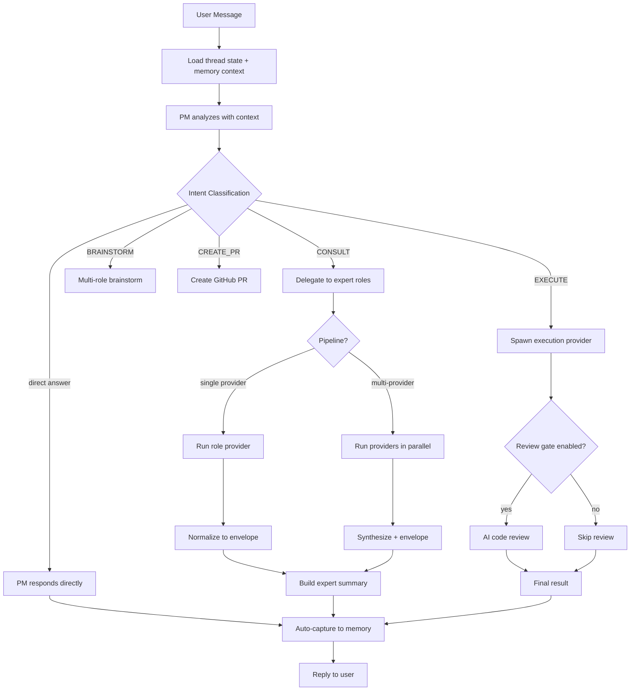
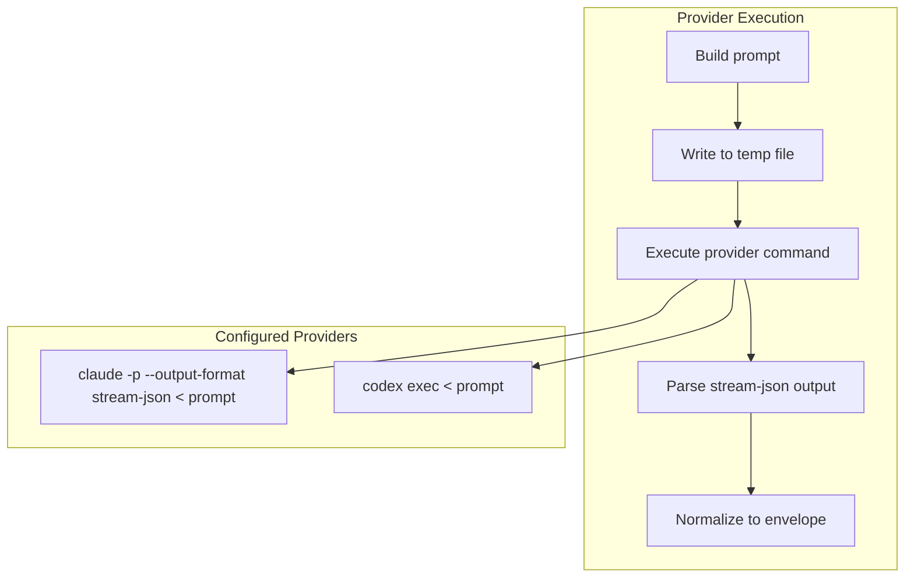
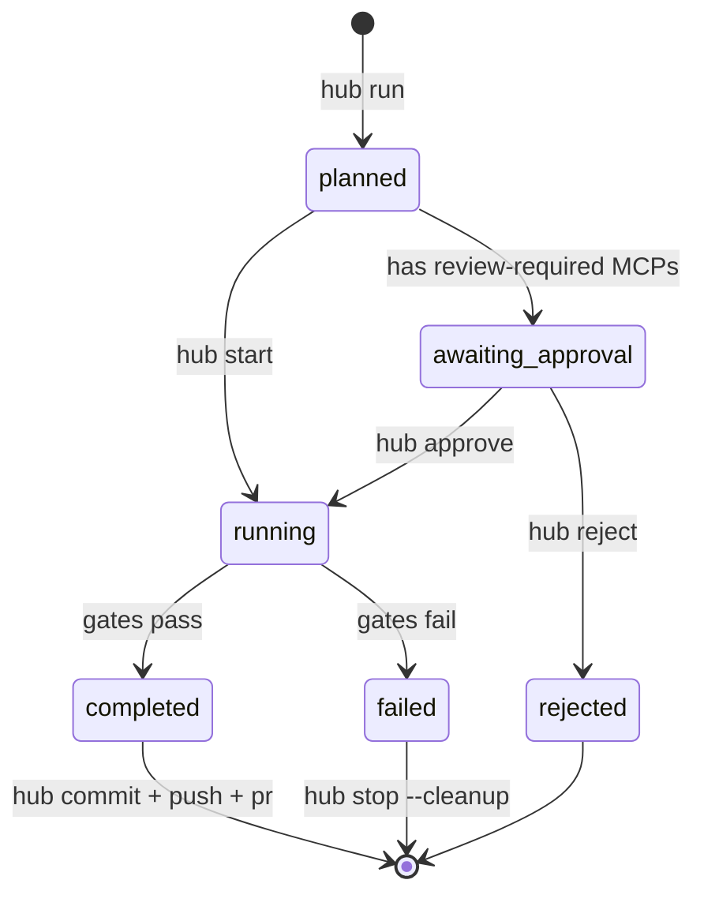
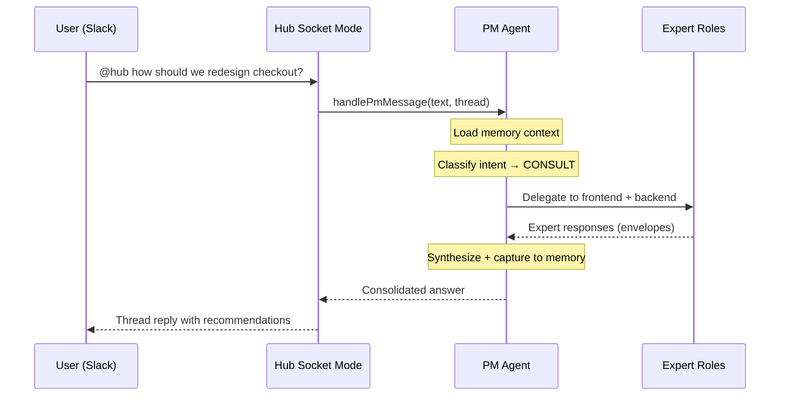

# Agent Hub — Detailed Documentation

## PM Agent Flow

The PM is the central orchestrator. Every user message flows through intent classification and action dispatch.



## Commands Reference

### Core

| Command | Description |
|---------|-------------|
| `hub init` | Interactive setup wizard |
| `hub chat --repo <path>` | Conversational PM mode |
| `hub run --repo <path> "task"` | Plan and execute a task |
| `hub review --repo <path>` | Manual code review |

### Run Lifecycle

| Command | Description |
|---------|-------------|
| `hub list` | List all runs |
| `hub status <run-id>` | Check run status |
| `hub start <run-id>` | Start execution (creates worktree) |
| `hub approve <run-id>` | Approve a pending run |
| `hub reject <run-id> [reason]` | Reject a run |
| `hub stop <run-id> [--cleanup]` | Stop and optionally clean up |
| `hub commit <run-id>` | Commit worktree changes |
| `hub push <run-id>` | Push branch to origin |
| `hub pr <run-id>` | Create GitHub PR |
| `hub pushpr <run-id>` | Push + PR in one step |

### Team

| Command | Description |
|---------|-------------|
| `hub team roles` | List configured roles |
| `hub team brainstorm --repo <path> "topic"` | Multi-role brainstorm session |
| `hub team provider-check --repo <path> --role <id> --topic "question"` | Test a provider |
| `hub team scaffold-role --repo <path> --id <id> --name "Name"` | Add role to repo config |

### Memory

| Command | Description |
|---------|-------------|
| `hub memory stats` | Show statistics |
| `hub memory search "query"` | Full-text search |
| `hub memory get <id>` | Get full observation |
| `hub memory delete <id>` | Soft-delete observation |

### Projects

| Command | Description |
|---------|-------------|
| `hub project list` | List all projects |
| `hub project show --name <n>` | Show project details |
| `hub project add --name <n>` | Create project |
| `hub project remove --name <n>` | Remove project |
| `hub project repo add --project <n> --label <l> --path <p> --type <t>` | Add repo to project |

### Slack

| Command | Description |
|---------|-------------|
| `hub slack socket` | Start Slack bot |
| `hub slack map channels` | List available channels |
| `hub slack map set --channel <ch> --repo <path>` | Map channel to repo |
| `hub slack map remove --channel <ch>` | Remove mapping |

### Profiles

| Command | Description |
|---------|-------------|
| `hub profile current` | Show active profile |
| `hub profile select <name>` | Switch GitHub profile |

## Provider System

Providers are command-line AI tools that execute prompts. The hub supports any CLI that reads from stdin and writes to stdout.



### Provider pipelines

For critical consultations, run multiple providers and synthesize:

```json
{
  "providerPipelines": {
    "technical-consult": {
      "backend": ["claude-teams", "codex"],
      "frontend": ["claude-teams", "codex"]
    }
  }
}
```

Both providers answer the same question. Results are cross-validated and merged into a single response.

### Command placeholders

| Placeholder | Value |
|-------------|-------|
| `{{prompt_file}}` | Path to the prompt temp file |
| `{{repo_path}}` | Target repository path |
| `{{role_id}}` | Role identifier (e.g. `backend`) |
| `{{role_name}}` | Role display name |
| `{{topic}}` | Question/topic |

## Standardized Envelope

All provider responses are normalized to a standard envelope:

```json
{
  "status": "completed",
  "summary": "Brief assessment",
  "recommendations": ["Action 1", "Action 2"],
  "risks": ["Risk 1"],
  "artifacts": [],
  "next_recommended": "Suggested next step"
}
```

Providers can return JSON directly or plain text — both are parsed and normalized. Legacy `{summary, assumptions, recommendations, risks, nextActions}` format is supported via backward-compatible mapping.

## Run Lifecycle



## Artifact Layout

```
hub/.state/
  runs/<run-id>/
    task-spec.json          Input specification
    policy-context.json     Merged policy rules
    mcp-context.json        MCP registry snapshot
    execution-plan.json     Steps + gates
    gate-report.json        Gate evaluation results
    task-result.json        Final output
    checkpoint.json         Portable checkpoint
  projects/<repo-slug>/
    checkpoint.latest.json  Latest project checkpoint
```

## Slack Integration



### Slack setup

1. Create a Slack app with Bot token scopes: `chat:write`, `app_mentions:read`
2. Enable Socket Mode
3. Subscribe to `app_mention` events
4. Copy tokens to `hub/config/slack/.env`
5. Run `hub slack socket`

### Channel routing

Map Slack channels to repositories or projects:

```bash
hub slack map set --channel "#payments" --repo /path/to/payments
hub slack map set --channel "#checkout" --project checkout
```

## MCP Server

The hub exposes 13 tools via Model Context Protocol for native Claude Code integration.

### Setup

```bash
claude mcp add agent-hub node /path/to/hub/bin/mcp.mjs
```

Or manually add to `.claude.json`:

```json
{
  "mcpServers": {
    "agent-hub": {
      "command": "node",
      "args": ["/path/to/hub/bin/mcp.mjs"]
    }
  }
}
```

### Tools

| Tool | Description |
|------|-------------|
| `memory_search` | Full-text search across observations |
| `memory_save` | Save decisions, patterns, errors, context |
| `memory_get` | Get full observation by ID |
| `memory_context` | Load relevant context for a project |
| `memory_delete` | Soft-delete an observation |
| `memory_stats` | Memory system statistics |
| `code_review` | AI-powered code review on git diff |
| `team_roles` | List team roles and providers |
| `team_config` | Show merged team configuration |
| `project_list` | List configured projects |
| `project_show` | Show project details |
| `session_start` | Start a memory session |
| `session_end` | End a memory session |

## Per-repo Configuration

Each target repository can have its own overrides:

```
my-repo/
  .agent-hub/
    team.json               Role/provider overrides
    repo-profile.json        Custom policy rules
    mcp-registry.json        MCP tool registry
```

Templates are in `hub/examples/`.

## Code Review Gate

Optional post-execution gate. Reviews git diff against project rules.

```json
{
  "gates": {
    "codeReview": {
      "enabled": true,
      "provider": "claude-teams",
      "rulesFile": "AGENTS.md",
      "maxDiffLines": 3000
    }
  }
}
```

Rules file resolution: `AGENTS.md` → `.agent-hub/AGENTS.md` → `CLAUDE.md`

Verdicts: `approve` (no issues), `comment` (warnings only), `request_changes` (critical issues).
